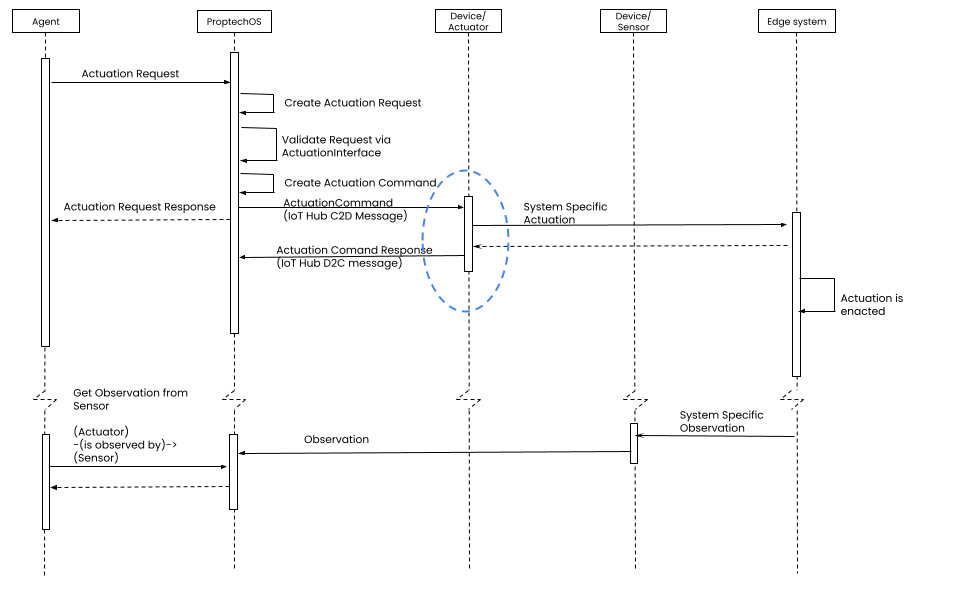

# Edge Connector Overview
The job of the Edge Connector can be split up into:

0. Auth and connection
1. ID translation
2. Format translation
3. Logic and buffering
4. Exception handling and meta-telemetry
5. Self-provisioning  
(the last three are not strictly needed for a basic edge connector)

## 0. Auth and connection
Since ProptechOS is built using Azure IoT technologies, connecting to the ProptechOS edge interface is really connection to [Azure IoT Hub](https://docs.microsoft.com/en-us/azure/iot-hub/). You can use the [IoT Hub SDK](https://github.com/Azure/azure-iot-sdks) and a Device Client or connect using a vanilla [MQTT client](https://mqtt.org/software/) or AMQP client. (Our [sample connector uses the Java Device Client](../examples)
ProptechOS relies on Device ID + Device Key for authentication and authorization. That means that even in cases where an edge connector handles many Devices (sometimes thousands), each Device is authorized separately (More on that under ID translation) instead of e.g. relying on a single certificate. On the other hand, all you need is the IoT Hub hostname and the Device ID and Key pair(s).

When developing your client, you can either test against ProptechOS, or if you need complete insight into logs and diagnostics you can set up your own Azure IoT Hub (for free). You can use our [Device connection checker tool](../examples/ProptechOS-device-connection-checker) to troubleshoot.

When you have successfully connected, you can use our [IoT Hub Listener tool](examples/ProptechOS-iothub-listener) to see if your messages are successfully sent to IoT Hub (more on this under Format translation). If your messages are correct RealEstateCore format (see 2. Format translation, below), you can use ProptechOS straight away, and see your messages in the Stream or in your sensor's `/sensor/{id}/observation/latest` endpoint of the API.

## 1. ID translation
In ProptechOS (as in all RealEstateCore platforms) edge messages are sent by Devices on behalf of Sensors or Actuators ("sub-devices"). The ProptechOS Device ID and Device Key is used to authorize each message. And similarly, messages are sent from ProptechOS to Devices on behalf of their sub-devices (e.g. an Actuation Command to an Actuator).

The ProptechOS ID of the Device sending the message and the sub-device it refers to is needed. Hence, the Edge Connector must be able to translate the IDs from the edge system (e.g. the BMS tag, the LoRa Dev-EUI or BACnet Device ID) to the equivalent ProptechOS IDs.

The edge connector can keep a map between the edge system ID and the ProptechOS ID, or rely on ProptechOS alias mapping. When using alias mapping, the edge connector will use the ProptehcOS API to look up the IDs. For instance, a BMS connector for the edge system `My BMS System` (sic) could query `proptechos.com/api/sensor?aliases=ns.proptechos.com/my-bms-system/my-tag-1-a` to get the ID of the ProptechOS sensor representing tag `my-tag-1-a` and its parent Device ID. (see more in the [Alias and Alias namespace section](../../ProptechOS-API/alias-alias-namespace))

### Sensor Alias
ProptechOS can receive edge messages with aliases as the `sensorId` value. So the Connector does not need to keep a map of all sensorIDs.

## 2. Format translation
In ProptechOS (as in all RealEstateCore platforms) only messages with valid [RealEstateCore edge message format](https://github.com/RealEstateCore/rec/tree/master/api/edge_messages) are allowed. Hence, the Edge Connector must be able to translate the data from the edge system into the RealEstateCore format. See additional specification details at the `api/edge_messages`section of [the RealEstateCore docs](https://github.com/RealEstateCore/rec).

### Message translation
For brevity, ProptechOS uses UUIDs instead of the full IRI for Device, Sensor and Actuator ID, and QuantityKind label instead of the full IRI.

A Sensor message (from a Device to ProptechOS) with two observations can look like the following:
```json
{
  "format": "rec3.2",
  "deviceId": "ac0d1c27-01fc-471e-87a3-f8bb7275cd65",
  "observations": [
    {
      "observationTime": "2020-06-27T20:07:44Z",
      "value": 22.1,
      "quantityKind": "Temperature",
      "sensorId" : "6b858eb6-ed37-43af-80dd-c4f8a4744625"
    },
    {
      "observationTime": "2020-06-27T20:09:44Z",
      "value": 3,
      "quantityKind": "Presence",
      "sensorId" : "e8d3cea7-8a32-4a2b-a146-cb4f754be653"
    }
  ]
}
```
Note that multiple Sensors can make observations (at different times) that are sent together in the same message. Also note that it is the Device that sends the message, and that the intended schema is stated explicitly.

Also note that times must always be sent in ISO-8601 and *in UTC* (2020-06-27T20:07:44**Z**).

An Actuation message (from ProptechOS to a Device) can look like the following:
```json
{
  "format": "rec3.2",
  "deviceId": "9c664221-ed4d-4215-a2fa-6dedfa69ce00",
  "actuationCommands":[
    {
      "actuationCommandTime": "2020-06-27T20:11:44Z",
      "actuationCommandId": "26c1f1cc-a5fa-4ab5-babb-c680c4ffa3cc",
      "actuatorId": "d671fd55-eb32-48bb-a9b2-f003d735c0e8",
      "valueString": "20.0"
    }
  ]
}
```
to which the Actuator (via the Device) could respond (from Device to ProptechOS):
```json
{
  "format": "rec3.2",
  "deviceId": "9c664221-ed4d-4215-a2fa-6dedfa69ce00",
  "actuationResponses":[
    {
      "actuationCommandId": "26c1f1cc-a5fa-4ab5-babb-c680c4ffa3cc",
      "actuatorId": "d671fd55-eb32-48bb-a9b2-f003d735c0e8",
      "responseCode": "success",
      "actuationResponseTime": "2020-06-27T20:11:45Z"
    }
  ]
}
```

Edge messages are meant to be easy to consolidate, so that e.g. the ActuationResponse could be combined with Observations:
```json
{
  "format": "rec3.2",
  "deviceId": "9c664221-ed4d-4215-a2fa-6dedfa69ce00",
  "actuationResponses":[
    {
      "actuationCommandId": "26c1f1cc-a5fa-4ab5-babb-c680c4ffa3cc",
      "actuatorId": "d671fd55-eb32-48bb-a9b2-f003d735c0e8",
      "responseCode": "success",
      "actuationResponseTime": "2020-06-27T20:11:45Z"
    }
  ],
  "observations": [
    {
      "observationTime": "2020-06-27T20:10:44Z",
      "value": 22.1,
      "quantityKind": "Temperature",
      "sensorId" : "9df365d3-023f-4f7b-a51f-9bdadb18ffbd"
    },
    {
      "observationTime": "2020-06-27T20:10:54Z",
      "value": 3,
      "quantityKind": "Presence",
      "sensorId" : "32e23d7e-ab9f-47c2-ae2d-060d1f21ce41"
    }
  ]
}
```

ProptechOS supports all RealEstateCore edge message format versions since v2.3

### Data translation
RealEstateCore have modelled and standardised quantity kinds and measurement units, following [QUDT](http://www.qudt.org/) and is using SI units. Hence telemetry values will need to be translated, e.g. MegaWatt to Watt or Inches to Meter.

## 3. Logic and buffering

Implementing Sensor observations for an edge connector is quite straight forward. Messages can just be forwarded to ProptechOS after ID and format translation.

### Actuation
With Actuator actuations, there is a little bit of logic that also needs to be covered. See a sequence diagram of the full Actuation logic (including the origin and follow-up via the API) and the Actuator highlighted below.



The Actuator should:
1. Receive the `Actuation Command`
2. Translate the actuation to a control signal with the Edge system.
3. Verify if the control signal is correct, and the Actuation is started to be enacted in the edge system. In cases where the edge system can acknowledge the control signal.
4. Respond to ProptechOS (`Actuation Response`) with a response code indicating if the edge system received and acknowledged the Actuation. Response code could be
   * `success` (comparable to HTTP status 200): the Actuation Command has been successfully received and the actuation in the underlying edge system has been attempted.
   * `rejected` (comparable to HTTP status 462): the Actuation Command was rejected by the Actuator before the actuation was attempted in the underlying system, or rejected by the underlying system. More details could possibly be expressed via an "Exception" message, see below (the Exception could be included in the same edge message, or sent in a separate message). The reason for a rejected Actuation Command could be that the format is incorrect, or that the edge system is offline.
   * `none` (comparable to HTTP status 460): The actuation has failed to be received or forwarded to the underlying system by some other possibly unknown reason. As with "rejected", more details could be sent in an Exception.)

The [sample Connector](../examples) implements the full actuation logic, so have a look at how this works in practice.

### Buffering and aggregation
In case of connectivity interruptions, the edge connector could buffer the messages and send them when connection is restored. Similarly, observation messages could be buffered so that they can be combined like described in (2. Format translation), or in cases with high frequency sensors it could desired that the connector buffers individual observations and aggregate them over a reasonable time period (e.g. a sensor measuring Voltage every 20 milliseconds could be aggregated to observations sent to ProptechOS every 15 seconds.).

## 4. Exception handling and meta-telemetry

### Exceptions
There is a simple standardised way for Devices to let their exceptions bubble up to ProptechOS. An array of exceptions can be added to any edge message from a Device to ProptechOS.

```json
{
  "format": "rec3.2",
  "deviceId": "ac0d1c27-01fc-471e-87a3-f8bb7275cd65",
  "exceptions":[
    {
      "exceptionTime": "2020-06-27T20:10:45Z",
      "origin": "sensor",
      "id": "6b858eb6-ed37-43af-80dd-c4f8a4744625",
      "exception": "Sensor timed out",
      "retry": 2
    }
  ]
}
```

As other edge messages, exceptions are sent from a Device, but can refer to not only the Device but also anyone of its sub-devices. This information is encoded in the `id` and `origin` properties. The exception example above is from the Temperature sensor from the observation example above in the *Format translation* section at the top. To describe the exception there is a string `exception` that can contain the error or exception message,  and a `retry` property that is 1 by default, and can increment the same exception has occured after retry(-ies).

### Edge Status
-- To be added. --

## 5. Self-provisioning
Edge connectors can use the ProptechOS API to self-provision its devices, or to self-discover devices that have already been provisioned.

**Overview:**
1. Get room/location
2. Create Device with Sensor(s)
3. Get Device Key

Let's use an example with a system (Acme IoT) self-provisioning presence sensors into a building ("Plaza 1", with littera "14111").

### 1. Get Room by littera ("room number")
`https://proptechos.com/api/json/room?littera=07-061&page=0&size=50`
(returns an array of length 0,...,* and the room we want)


Note that *room number* might not be unique across all buildings, so that the returned array is longer than 1, and that the room you are after is not the first entry.  
In that case we would first need the building in question.

Either by the building littera, if that is known  
  `https://proptechos.com/api/json/realestatecomponent?littera=14111-001&page=0&size=50`  
or building coordinates  
  `https://proptechos.com/api/json/realestatecomponent/inrange?lat=59.3328&lon=18.0665&dist=0.05`  
(search within 50 meter radius)

and then, knowing the building, get the room by littera  
  `https://proptechos.com/api/json/room?building_ids=8cc3f507-5ae1-4322-8f2d-756e1eea8dfa&littera=07-061&page=0&size=50`

### 2. Create Device with Sensor
First create Device:
`(POST) https://proptechos.com/api/json/device`
with body:
```json
{
  "class": "Device",
  "comment": {},
  "littera": "Acme-07-4061",
  "popularName": "Acme IoT Room Sensor 07-4061 ",
  "hasDeviceFunctionType": "https://w3id.org/rec/device/DataAcquisition",
  "isMountedInBuildingComponent": "df9429eb-6e71-493f-99cb-565c697935be",
}
```

get the created object, with ID in return. (called "returnDeviceId" below)

Then add the sensor:  
`(POST) https://proptechos.com/api/json/device`  
with body:
```json
{
  "class": "Sensor",
  "isMountedInBuildingComponent": "df9429eb-6e71-493f-99cb-565c697935be",
  "servesBuildingComponent": "df9429eb-6e71-493f-99cb-565c697935be",
  "hasSuperDevice": "<< returnDeviceId >>",
  "deviceMeasurementUnit": "http://proptechos.com/ontology/extension/Index",
  "deviceQuantityKind": "https://w3id.org/rec/core/Presence",
  "devicePlacementContext": "https://w3id.org/rec/device/IndoorAir",
}
```

(it is also possible to do this using the /api/json/sensor endpoint)


### 3. Get Device Key
`https://proptechos.com/api/json/device/<< returnDeviceId >>/key`  

All Provisioned and good to go.
