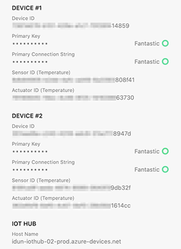
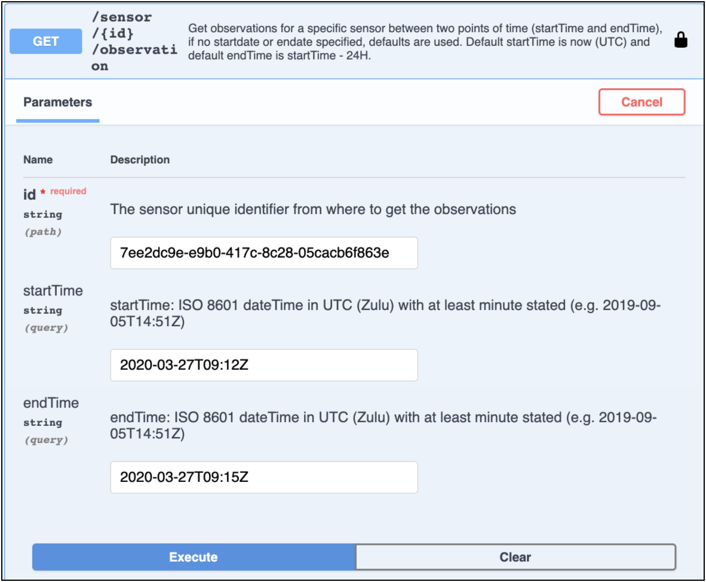
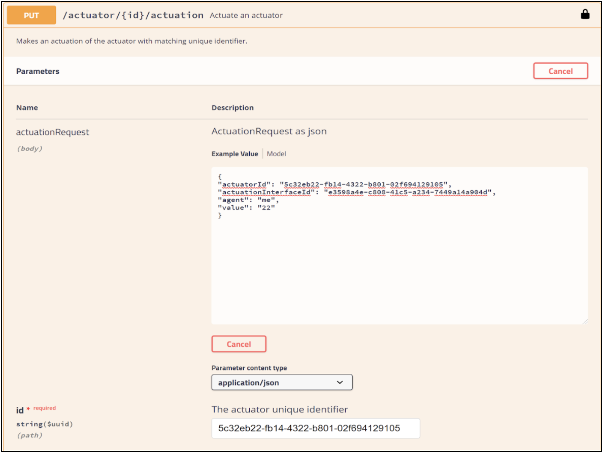

# Edge Interface

## Edge Messages
ProptechOS use the RealEstateCore Edge message format for messages to and from edge Devices, like Sensors and Actuators. Use the [documentation from RealEstateCore](https://github.com/RealEstateCore/rec/tree/master/api/edge_messages) to get more familiar with how the edge messages can be used.

## Get started - Edge development Kit
To get going you will need get the following:

- user access to ProptechOS
- a set of test devices and credentials for those devices

### Test Device Credentials
- IoT Hub Hostname (`iotHubAddress` in the examples)
- Device ID (`deviceId` in examples)
- Device Key (`deviceKey` in examples)
- Sensor ID (`sensorId` in examples)
- Sensor QuantityKind (`QuantityKind` in examples)
- Actuator ID (`actuatorId` in examples)

When starting the ProptechOS Edge Connector development, Idun will set up acces, and a set of test devices. The device key and other secrets will be shared using [1Password](https://1password.com/) in a vault like the image below. Idun will invite you to 1Password. Accept the invitation, and after Idun has confimred your account and set up a shared vault, you can access your test device information.


  
Edge Dev Kit credentials in 1Password vault

# Edge Connector Module Development Guide

The intention of this guide is to help a developer to get started developing an Edge Connector for ProptechOS. An RealEstateCore Edge Connector sends and receives RealEstateCore edge messages to a RealEstateCore system. Observations are sent from the Edge system and ActuationCommands are sent from the RealEstateCore system and received by the edge system. To get more familiar with RealEstateCore edge messages, see the [Edge message specification at the RealEstateCore Github repository](https://github.com/RealEstateCore/rec/tree/master/api/edge_messages).

ProptechOS is built using the Microsoft suite of underlying IoT technologies. Hence, a RealEstateCore edge connector for ProptechOS sends RealEstateCore edge messages using a client compatible with the Microsoft IoT Hub. The easiest way to get started is to use the Microsoft IoT Hub Client, which is what this guide describes.

As added illustrations for the guide, we have built a simple example Edge Connector, ProptechOS-REC-connector (see [the Edge Interface example folder](examples)). Have a look and compare the example code with the description in this guide.

## Edge Connector development

The Development guide is based on Microsoft’s IoT quickstart documentations:  
[Quickstart: Send telemetry to an Azure IoT hub and read it with a Java application](https://docs.microsoft.com/en-us/azure/iot-hub/quickstart-send-telemetry-java)  
[Quickstart: Send cloud-to-device messages with IoT Hub](https://docs.microsoft.com/en-us/azure/iot-hub/iot-hub-java-java-c2d)  
Use those guides and other Microsoft documentation to find additional details about protocols, clients, gateways and details on a lower level.

### Edge Connector implementation

To implement connector we need to cover a couple of basic things:
* **Parse configuration**  
In order to use json configuration throughout the project we need to parse a json file to java object. We will use the configuration values to simulate a device with a valid connection string and sensors (as RealEstateCore subdevices).
* **Generate (simulated) telemetry**  
In this step we will create a generator class that will simulate messages from our device and sensors.
* **Send the telemetry messages**  
To simulate a real device we need to periodically send messages. We will implement this behaviour in scope of this step.
* **Implement message callback**  
When we create actuation via ProptechOS we need something to receive those actuation messages. The callback implemented in this section will be responsible for that.
* **Generate (simulated) device actuation response**  
This is similar to generation of telemetry from the device, but here we simulate a response from the device, so that ProptechOS understands if the device received the ActuationCommand or not.
* **Implement main() method that runs the DeviceClient.**  
main() method is the starting point for our connector application. In scope of this method, we will use all the classes described above.

### Prerequisite

* Have access to a ProptechOS instance
* Have Device created and  registered in ProptechOS and have both Device Id and Key
* Have Sensors created in ProptechOS (the Sensor should be a subDevice of the Device above)
* Have Actuators created in ProptechOS (the Actuator should be a subDevice of the Device above)
* Java SE Development Kit 8 or higher
* Apache Maven 3
* Port 8883 must be open in your firewall. We will use MQTT protocol, which communicates over port 8883. This port may be blocked in some corporate and educational network environments.

### Parse configuration
1. Add a json configuration file to the resources folder. Using this format:

```json
{
	“iotHubAdress”: "youriothub.azure-devices.net",
	“deviceId”: "device_id_from_ProptechOS",
	“deviceKey”: "device_key_from_ProptechOS",
	“sensors”: [
		{
			“quantityKind”: "Temperature",
			“sensorId”: "sensor_id_from_ProptechOS"
		}
	],
	“actuators”: [
		{
			“actuatorId”: "actuator_id_from_ProptechOS"
		}
	]
}
```
2. Create a java class that will contain all the values from configuration. Add method to created class:
`public String createConnectionString();`  
this method should return a connection string to the device which is registered in the IoT hub. Connection string format is next:
`“HostName=iotHubAdress;DeviceId=deviceId;SharedAccessKey=deviceKey”`  
We will need this connection string to create DeviceClient [Azure Docs - DeviceClient class](https://docs.microsoft.com/en-us/java/api/com.microsoft.azure.sdk.iot.device.deviceclient?view=azure-java-stable)

### Generate (simulated) telemetry
1. Our telemetry will be RecMessage class with fields:

```java
private final String format = "rec3.1.1";
private String deviceId;
private List<RecObservation> observations;
private List<RecActuationCommand> actuationCommands;
private List<RecActuationResponse> actuationResponses;
private ModuleMessage edgeState;
```
where `RecObservation` is class with fields:

```java
private final ZonedDateTime observationTime;
private final Object value;
private final String quantityKind;
private final String sensorId;
```

This `RecMessage` is the actual content that will be sent to ProptechOS.  
We will talk about `RecActuationCommand` and `RecActuationResponse` in more detail when we move to receiving messages from the ProptechOS section.  
`ModuleMessage` object will not be used in our example.

2. Create new class TelemetryGenerator and implement next methods

```java
public RecMessage generateTelemetry();
private double generateRandomTemperature();
private Sensor getRandomSensor();
```

`generateTelemetry()` should create a `RecMessage` with randomly generated temperature for sensorId which is randomly chosen from config file.

### Send the telemetry messages
Create a new java class. Let this class implement a Runnable interface, since we want to send our messages in a separate thread, in order not to block the parent thread with infinite loop. This interface will require an overridden `run()` method.

Implementation of run() method:
* Use `generateTelemetry()` from `TelemetryGenerator`
* Parse received  `RecMessage` to a JSON string or to a byte array. Pass parsed `RecMessage` as parameter of  `Message` object constructor. [Azure docs - Message Class](https://docs.microsoft.com/en-us/java/api/com.microsoft.azure.sdk.iot.device.message?view=azure-java-stable)  
* send created `Message` using `DeviceClient` method
`sendEventAsync(Message message, IotHubEventCallback callback, Object callbackContext)`
 * `message Message` - the message to be sent.
 * `callback IotHubEventCallback` - the callback to be invoked when a response is received. Can be null.
 * `callbackContext Object` - a context to be passed to the callback. Can be null
* add `Thread.sleep(sendPeriod)` in order to send messages with the frequency every `sendPeriod` that you will specify

### Implement message callback, to receive messages from ProptechOS
The Actuation that we recreate with our simple connector,  is next:
1. ActuationCommand created in ProptechOS (most commonly via the API)
2. the Edge connector receives `RecMessage` with `RecActuationCommand`
3. Edge connector creates new `RecMessage` with `RecActuationResponse`  and sends it to ProptechOS
Temperature values of device should be changed to one from the actuation command.
where `RecActuationCommand` is a class with fields:

```java
private final ZonedDateTime actuationCommandTime;
private final String actuationCommandId;
private final String actuatorId;
private final String value;
```

and `RecActuationResponse` is a class with fields:

```java
private final ZonedDateTime actuationResponseTime;
private final String actuationCommandId;
private final String actuatorId;
private final ActuationResponseCode responseCode;
```

`ActuationResponseCode` is the enum with only two values `SUCCESS` and `REJECTED`. So, this is pretty straightforward, we send `SUCCESS` in case if the device received actuation and everything is ok, `REJECTED` is sent in case if device did not receive message or some error.

Create a new java class. Let this class implement `MessageCallback`. As it is an interface, it will ask you to implement one method:  
`public IotHubMessageResult execute(Message message, Object o)`
* `Message message` - the message we receive from ProptechOS  
this method returns `IotHubMessageResult` which is not really needed in our example.  
In scope of  execute method we need to:
 * parse message content to `RecMessage`
 * use `getSimulatedMessageFromDevice()` method (described in the next section) to create a new  `RecMessage`. Send this message to ProptechOS with help of `sendEventAsync` method of `DeviceClient` (the same method that we have used in Send the telemetry messages section)
 * change temperature values, which are generated randomly for sensors, to temperature value from actuation command.


 #### Generate (simulated) device actuation response
 To let ProptechOS understand if the message was processed correctly and the device has received the message, we need to create `RecActuationResponse` for every `RecActuationCommand`.
 Create a new java class with method  
 `public RecMessage getSimulatedMessageFromDevice(RecMessage  messageFromCloud)`  
 Implementation of `getSimulatedMessageFromDevice`:
 * create new `RecMessage`
 * iterate through the list of `RecActuationCommand`’s in `messageFromCloud`. For every actuation command we need to create `RecActuationResponse` with `SUCCESS ActuationResponseCode`
 return newly created `RecMessage`

### Implement main() method that run the DeviceClient
Create a simple Java class, call it something that represents your connector This class should have the `main()` method implemented, that will be a starting point of our application.  
`public static void main(String[] args);`

Implementation of `main(String[] args)` method:
* Parse configuration file to java object.
* Create `DeviceClient` object using constructor  
`new DeviceClient(String connString, IotHubClientProtocol protocol)`
 * `connString` is a connection string that method createConnectionString()  provides.
 * As `protocol`, use `MQTT` or `ÀMQP` protocol from `IotHubClientProtocol` enum (See [docs.microsoft.com - iot-hub-devguide-protocols](https://docs.microsoft.com/en-us/azure/iot-hub/iot-hub-devguide-protocols) for list and comparison of possible protocols)
* Create an instance of class that implements `MessageCallback`. Use `DeviceClient setMessageCallback` [details](https://docs.microsoft.com/en-us/java/api/com.microsoft.azure.sdk.iot.device.deviceclient.setmessagecallback?view=azure-java-stable#com_microsoft_azure_sdk_iot_device_DeviceClient_setMessageCallback_MessageCallback_Object_) method to set the callback that we have implemented earlier.
* Create new Thread or use Executor in order to start `MessagesSender` thread send messages

## Verify the Edge Connector
### Sending observations
To check what observation messages are sent to ProptechOS add `System.out. println(“Sending message: ” + message)`or add some simple logging.  And you should see in application console something similar to this:

```
SLF4J: Defaulting to no-operation (NOP) logger implementation
SLF4J: See http://www.slf4j.org/codes.html#StaticLoggerBinder for further details.
Press ENTER to exit.
Sending message: {"format":"rec3.1.1","deviceId":"6329851e-878c-41e1-a980-04577c72290f",
"observations":[{"observationTime":"2020-03-27T09:12:51.6874058Z","value":24.221417634196257,"quantityKind":"Temperature","sensorId":"7ee2dc9e-e9b0-417c-8c28-05cacb6f863e"}]}
Sending message: {"format":"rec3.1.1","deviceId":"6329851e-878c-41e1-a980-04577c72290f",
"observations":[{"observationTime":"2020-03-27T09:12:56.6899086Z","value":18.34789332490643,"quantityKind":"Temperature","sensorId":"7ee2dc9e-e9b0-417c-8c28-05cacb6f863e"}]}
Sending message: {"format":"rec3.1.1","deviceId":"6329851e-878c-41e1-a980-04577c72290f",
"observations":[{"observationTime":"2020-03-27T09:13:01.6943853Z","value":20.894724160375738,"quantityKind":"Temperature","sensorId":"7ee2dc9e-e9b0-417c-8c28-05cacb6f863e"}]}
```


Those are RealEstateCore messages that are sent from the Edge Connector to ProptechOS

### ProptechOS receiving observations
Now we need to see if those simulated observations are actually received by ProptechOS.

First authorize ProptechOS REST API, see [ProptechOS-Api Example](ProptechOS-Api) for directions on how to do that.  
To verify that Observations from the simulated device are received, we need to see them in the ProptechOS API.

```curl
GET foo.proptechos.com/api/sensor/{mySensorId}/observation
```

with `startTime={firstObsTime}` and `endTime={lastObsTime}` in the query string.

exchange
* `{mySensorId}` with your Sensor
* `{firstObsTime}` with a timestamp´before the first Observation you want to confirm
* `{lastObsTime}` with a timestamp after the last Observation you want to confirm
(If `startTime`and `èndTime` is omitted, the API uses the last 24 hrs from _now_ as default.)

following this example:

```
//line breaks for clarity
GET foo.proptechos.com/api/sensor/7ee2dc9e-e9b0-417c-8c28-05cacb6f863e/
observation?
startTime=2020-03-27T09%3A12Z
&endTime=2020-03-27T09%3A15Z
```

You should see your Observations in the response:

```JSON
[
  {
    "observationTime": "2020-03-27T09:12:51.687405800Z",
    "value": 24.221417634196257
  },
  {
    "observationTime": "2020-03-27T09:12:56.689908600Z",
    "value": 18.34789332490643
  },
  {
    "observationTime": "2020-03-27T09:13:01.694385300Z",
    "value": 20.894724160375738
  }
]
```

If  the Observations  match, you have done everything correctly.

An easy way to get authenticated and authorized, and to make the request for /observation/ is to use the Open API Specification Docs, (“Swagger docs”), provided by ProptechOS (see screenshot below).



### ProptechOS sending actuations
To send the actuation we need to use the PUT request method.

```
//line breaks for clarity
PUT -H "Content-Type: application/json" -d {json object}
foo.proptechos.com/api/actuator/{id}/actuation
```

exchange
* `{json object}` using next json format
```JSON
{
    "actuatorId": "string",
    "actuationInterface": "string",
    "agent": "string",
    "value": "string"
}
```

as actuationInterface use any interface that suits your actuation.
* `{id}` with id of actuator that you about to use

The easier way to send actuation is again, to use the Open API Specification Docs, provided by ProptechOS



### Edge Connector receiving actuations
Now we can check in our connector console logs if it receives any messages from ProptechOS. As we run sending and receiving messages in parallel, we will see outcoming and incoming messages in one list You should see next messages in console:

Sending observation message (like above):
```JSON
{
  "format": "rec3.1.1",
  "deviceId": "c16d5e09-ed5c-4297-b6b9-cc733b1b1065",
  "observations": [
    {
      "observationTime": "2020-04-06T10:29:07.2046508Z",
      "value": 27.95085485792415,
      "quantityKind": "Temperature",
      "sensorId": "e8f94180-38c3-4ad7-a93e-bebe9cd2c69c"
    }
  ],
  "exceptions": null,
  "actuationCommands": null,
  "actuationResponses": null
}
```

Incoming ActuationCommand message:
```json
{
	"format":"rec3.1.1",
	"deviceId":"7387e678-b151-426e-a1c7-70f26f414859",
	"observations":null,
	"actuationCommands":[
		{
			"actuationCommandId":"3cf655ee-4d35-4f00-90f1-c2edd9495c42",
			"actuatorId":"79190645-19ec-4c46-9f25-191639663730",
			"value":"25",
      "actuationCommandTime":"2020-05-14T12:53:32.356377Z"
		}
	],
	"actuationResponses":[],
	"exceptions":null,
	"edgeStatus":null
}
```
("edgeStatus" is an ProptechOS-specific  property that can be ignored)

Sending ActuationResponse message:
```json
{
	"format":"rec3.1.1",
	"deviceId":"7387e678-b151-426e-a1c7-70f26f414859",
	"observations":[],
	"exceptions":[],
	"actuationCommands":[],
	"actuationResponses":[
		{
			"actuatorId":"79190645-19ec-4c46-9f25-191639663730",
			"actuationCommandId":"3cf655ee-4d35-4f00-90f1-c2edd9495c42",
			"responseCode":"success",
			"actuationResponseTime":"2020-05-14T12:53:31.5747577Z"
    }
  ]
}
```

Incoming ActuationCommand message is the RealEsateCore cloud-to-edge message that we have received from ProptechOS, and Sending ActuationResponse is the edge-to-cloud message that goes back to ProptechOS informing that actuation was successful.

The last check that can be done to verify that actuation flow is successful is to repeat the “ProptechOS receiving observations” step. You should see in the observations value the same as you have set in the actuation value field.

## Appendix
### Bootstrap new project
1. Create simple, empty java project Using Apache Maven:

```
mvn archetype:generate
-DgroupId={project-packaging}
-DartifactId={project-name} -DarchetypeArtifactId={maven-template} -DinteractiveMode=false
```
Import the project folder you just created with project files to your IDE as a Maven project.

2. Add dependencies to maven project pom.xml

```xml
<dependencies>
    <dependency>
      <groupId>com.microsoft.azure.sdk.iot</groupId>
      <artifactId>iot-device-client</artifactId>
      <version>1.16.0</version>
    </dependency>
    <dependency>
      <groupId>com.fasterxml.jackson.datatype</groupId>
      <artifactId>jackson-datatype-jsr310</artifactId>
      <version>2.9.4</version>
    </dependency>
</dependencies>
```

Note that versions of dependencies above are the last stable versions at the time of writing this documentation. You can check if there are newer versions of those libraries and use them.

## Implemented Edge Connectors
All of the connectors below consume data from underlying systems, transforms received data to RealEstateCore format messages,
and sends them to ProptechOS. For some connectors reverted flow is possible,
connector receives messages from ProptechOS and transforms it to s message that the underlying system can process(Actuations). See availability in table 

``

| Module name   | Description                                                                    | Status      | Observations | Actuations | 
| ------------- | ------------------------------------------------------------------------------ | ----------- | ------------ | ---------- |
| EMU           | Interacting with EMU Professional TCP/IP devices. Http client based            | Available   |     Yes      |     No     |
| Lummelunda | Module for interacting with Lummelunda Web API. Http client based, establishes sessions using server URL and auth credentials  | Available   |     Yes      |     No     |
| Kabona        | Communicate with Scada Kabona API. Http client based, establishes sessions using server URL and auth credentials. | Available   |     Yes      |     Yes    |
| LoRaWAN       | Interacting with LoRaWAN Event hub. Subscribes to Azure Event Hub messages.    | Available   |     Yes      |     No     |
| Mestro        | Interacting with Mestro API(1.2.0). Http client based, establishes sessions using server URL and auth credentials.    | Available |     No       |     No     |
| Metry         | Interacting with Metry API. Http client based, establishes sessions using server URL and access token.  | Available   |     Yes      |     No     |
| Modbus        | Interacting with Bastec devices by using Modbus TCP. Uses Modbus client from modbus-master-tcp java library. | Available   |     Yes      |     Yes    |
| OPC UA        | Interacting with OPC UA Servers. Http client based, establishes sessions using server URL and auth credentials. | Available   |     Yes      |     Yes    |
| Schneider     | Mqtt client which is connected to Schneider system mqtt broker.                | Available   |     Yes      |     Yes    |
| SMHI          | Interacting with SMHI API. Supported device types are FORECAST and ANALYSIS. Http client based  | Available   |     Yes      |     No     |
| Web Port      | Communicate with Wep Port API. Http client based, establishes sessions using server URL and auth credentials.  | Available   |     Yes      |     Yes    |
| Larmia        | Partner module.                                                                | Available   |     Yes      |      Yes   |
| Nordomatic    | Partner module for styrportalen.                                               | In progress |     Yes      |    Yes     |
| ERTEK         | Partner module for PLCs.                                                       | In progress |     Yes      |    Yes     |
| eSys          | Partner module for meters (m-bus)                                              | In progress |     Yes      |    No      |
| Flowity       | Partner module for camera and ML-based presence analysis.                      | In progress |     Yes      |    No      |
| Talkpool      | Partner module.                                                                | In progress |     Yes      |    No      |
| Disruptive Technologies  | Generates JWT access token and subscribes to disruptive API Server Sent Events, SSE, for all devices in config file(api limit is 50 active :stream connections per user or service-account)  | Available |     Yes      |    No      |
| Helvar        | Interacting with Helvar API. Http client based, establishes sessions using server URL and api key.                                                                               | Available |     Yes      |    No      |
| Freesi        | Interacting with Freesi REST API. Http client based, establishes sessions using server URL and cookie provided by API.                                                                             | Available |     Yes      |    No      |
| Treon         | Interacting with YIT Event hub. Subscribes to Azure Event Hub messages using kafka client                                                                               | Available |     Yes      |    No      |
| Integral      | Interacting with YIT Event hub. Subscribes to Azure Event Hub messages using kafka client                                                                              | Available |     Yes      |    No      |
| Haltian       | Mqtt client which is connected to Haltian system mqtt broker.                                                                                | Available |     Yes      |    No      |
| UbiqiSense    | Camera and ML based presence analysis. Interacting with UbiqiSense API. Http client based, establishes sessions using server URL and access token.                                        | Available |     Yes      |    No      |
| Cisco         | Camera and ML based presence analysis.                                         | In progress |     Yes      |    No      |
