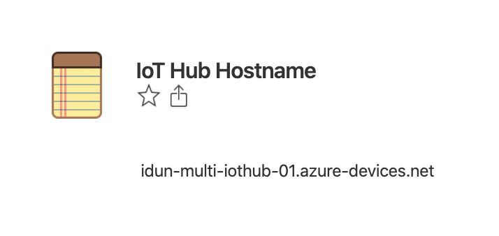
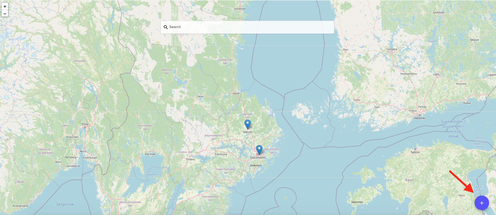
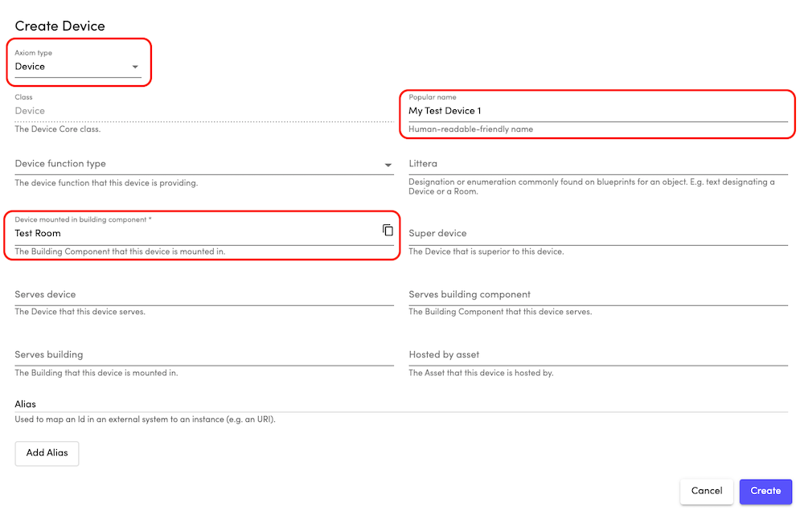
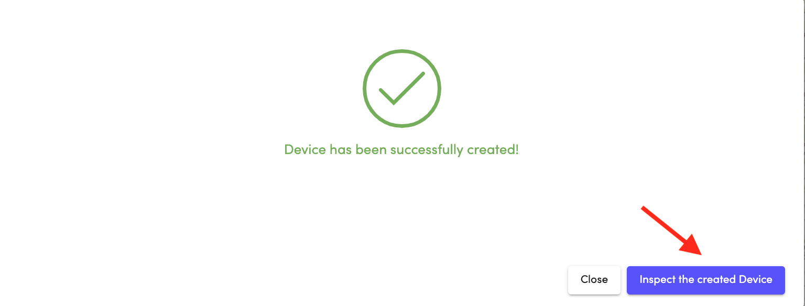
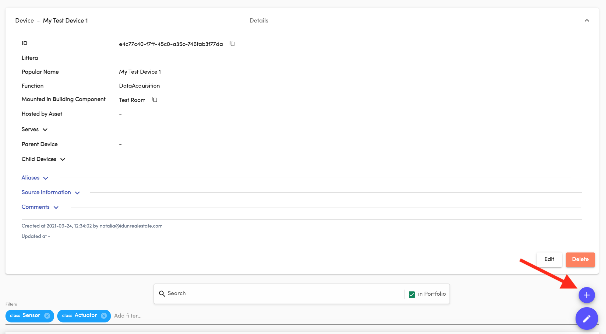
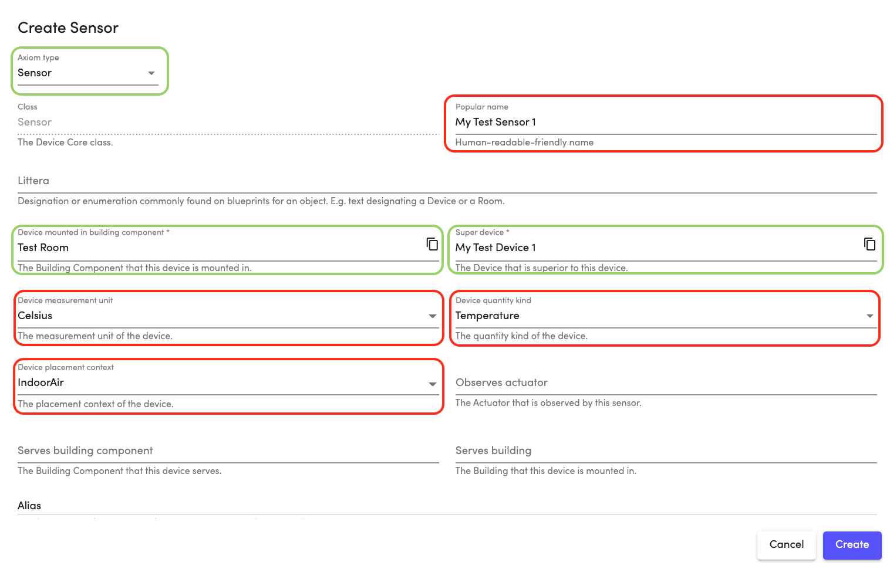
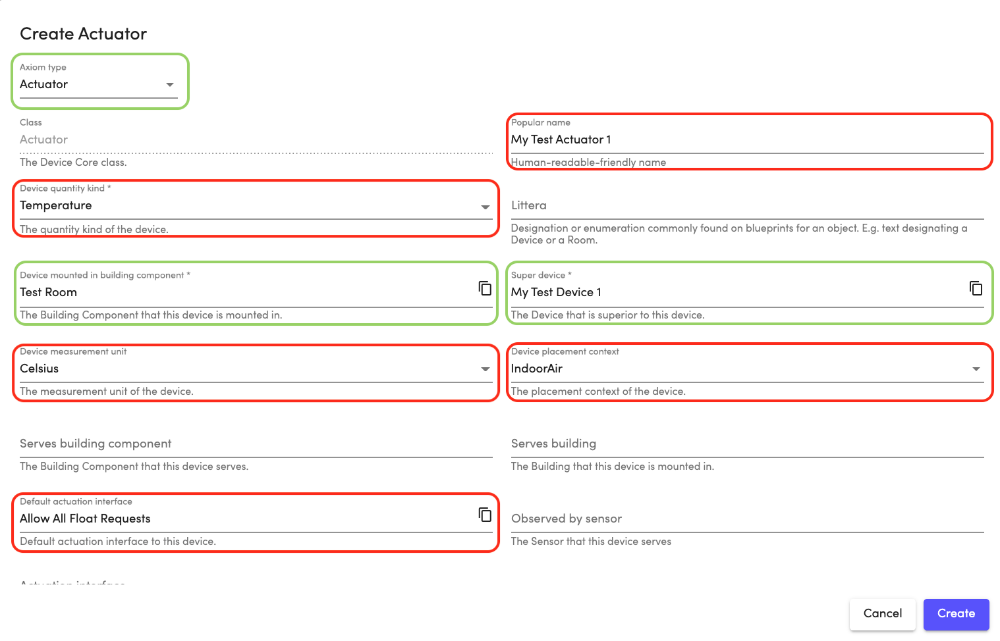

# Development Kit
When starting the ProptechOS Edge Connector development, Idun can also help you get going by setting up access. The Edge URL of a dedicated cloud instance of ProptechOS (and optionally Application ID and Client secret) will be shared using [1Password](https://1password.com/) in a vault like the image below. Idun will invite you to 1Password. Accept the invitation, and after Idun has confirmed your account and set up a shared vault, you can access the information shared with you.

*IoT Hub Hostname in 1Password vault*

You can create your test Devices via API or the user interface. The images below show how to do that via user interface with minimum effort.

## Create a Device

Press the + button in the right bottom corner.

In the pop-up window select Axiom type **Device**. Choose any **Popular name** and mount the Device in any **BuildingComponent/Room** (if it is a test environment). Other fields can be left blank.

Go to **Inspect the created Device** to open a Device view page.

## Create a Sensor
You can create a Sensor from the Device view. Press the + button in the right bottom corner.

In the pop-up window Axiom type **Sensor**, **Super device** and its location in **Room** are already pre-selected.
Choose some **Popular name** and select **Measurement Unit**, **Quantity Kind** and **Placement Context**.

## Create an Actuator
You can create an Actuator from the Sensor view. Press the + button in the right bottom corner.

In the pop-up window Axiom type **Actuator**, **Super device** and its location in **Room** are already pre-selected.
Choose some **Popular name** and select **Measurement Unit**, **Quantity Kind**, **Placement Context** and **Default Actuation Interface**.

