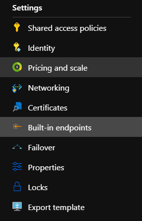

This is simple implementation of Kafka Connector, using spring kafka library.
Connector can be used to read telemetry data from devices connected to the Azure IoT Hub.

To use this application just put your iot hub built-in endpoint properties in application.properties in resources directory. E.g. :

```
event.hub.name={iothubname}

spring.kafka.bootstrap-servers={name of build-in endpoint}.servicebus.windows.net:9093
spring.kafka.consumer.group-id=$Default
spring.kafka.consumer.properties.request.timeout.ms=60000
spring.kafka.properties.security.protocol=SASL_SSL
spring.kafka.properties.sasl.mechanism=PLAIN
spring.kafka.properties.sasl.jaas.config=org.apache.kafka.common.security.plain.PlainLoginModule required username="$ConnectionString" password="{Build-in event hub-compatible endpoint}";
```

Where `event.hub.name` this is name of IoT Hub you want to listen to.

`{Build-in event hub-compatible endpoint}`, here should be connection string to build-in endpoint. 
You can find this connection string in Build-in endpoints section.

  


