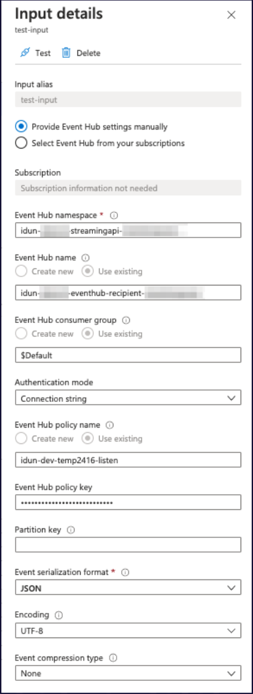

# Consume ProptechOS stream API with Azure StreamAnalytics

1. Add an input of type: "Event Hub"
2. Name your input ("input alias")
3. Choose “Provide Event Hub settings manually”
4. Input configurations using parts of your stream api connection string.

| Parameter | Value | Find in connection string |
| --------- | ----- | --------------------------|
| Event Hub namespace | idun-xxxxx-streamingapi-xxxxx | Endpoint=sb://<<Event Hub namespace is here>>.servicebus.windows.net/
| Event Hub name (Use existing) | idun-xxxxx-eventhub-recipient-xxxxx | EntityPath |
| Event Hub consumer group | leave defaults in place: choose “Use existing” and “$Default” | n/a |
| Authentication mode | Choose “Connection string” | n/a |
| Event Hub policy name | idun-xxxxx-eventhub-recipient-listen | SharedAccessKeyName |
| Event Hub policy key | xxxxx | SharedAccessKey |
| Partition key | (can be empty) | n/a |
| Event serialization format:  | JSON | n/a |
| Encoding | UTF-8 | n/a |
| Event compression type | None | n/a |

  
