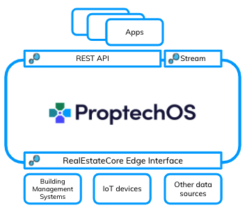

  

# ProptechOS Developer Examples
[Develop apps for ProptechOS](https://proptechos.com/)  
See examples for partial or end-to-end illustrations

For Documentation, please see our `docs` repository [github.com/idun-corp/docs](https://github.com/idun-corp/docs)

## API
The API lets you explore and edit the knowledge graph, query telemetry, execute actuations and provision devices.  
[Using the ProptechOS API](ProptechOS-Api)  
[ProptechOS API Swagger Docs](https://proptechos.com/api/swagger-ui.html)

## Streaming API
The streaming API lets you consume telemetry.  
[Consuming Idun ProptechOS Streaming API](ProptechOS-Streaming-Api)

## Edge Interface
The Edge Interface is for Devices communicating with ProptechOS.
Devices send Observations, receive and repond to Actuations and send status messages.
[ProptechOS Edge Interface and sample Connector](ProptechOS-Edge-Interface).  

## Contribute

Read our [Contributing guidance](https://github.com/idun-corp/docs/blob/master/CONTRIBUTING.md).

Contributing to the documentation requires a GitHub account. If you don't have an account, follow the instructions for the [GitHub account setup](https://docs.github.com/en/get-started/onboarding/getting-started-with-your-github-account) from GitHub documentation page.
